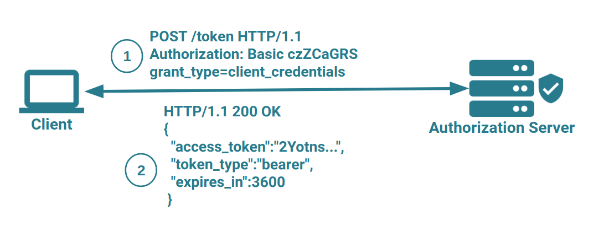
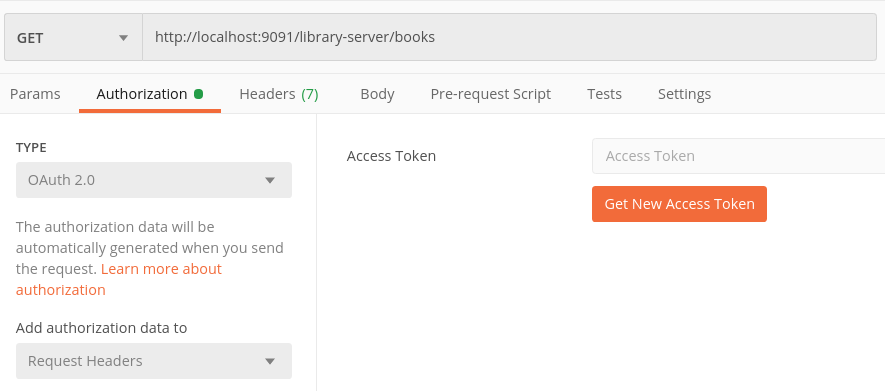
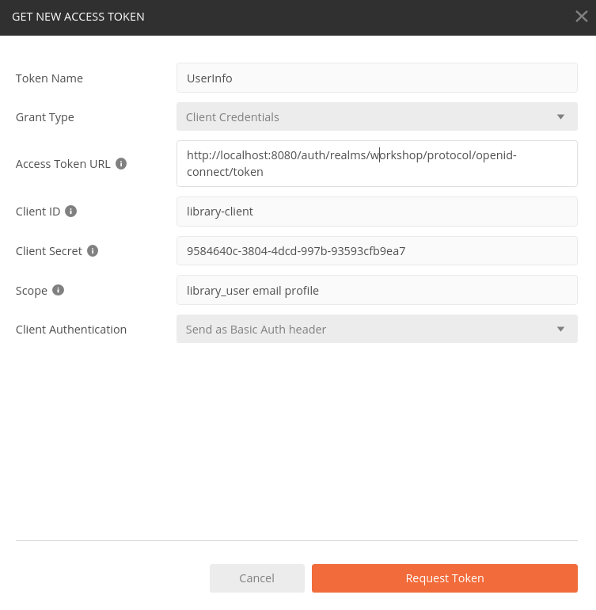
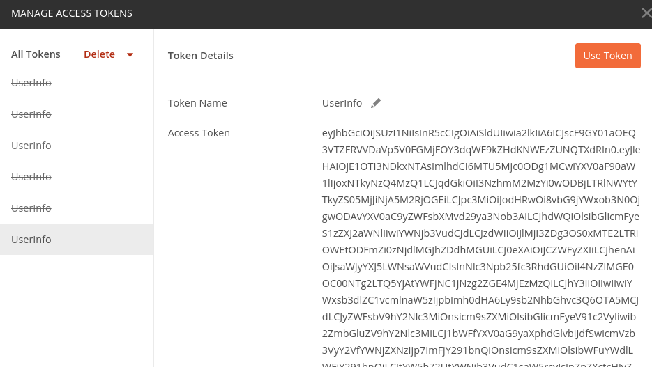
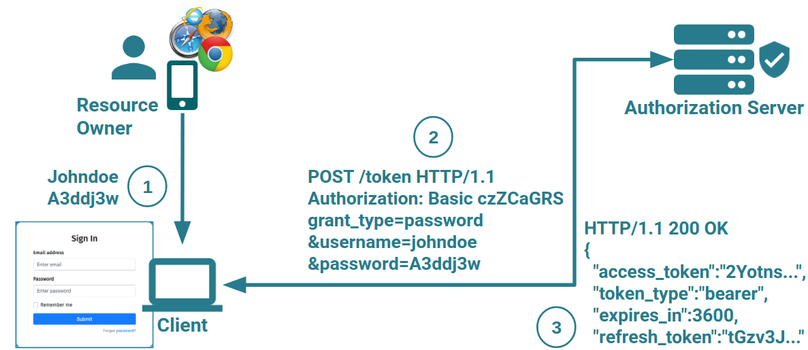
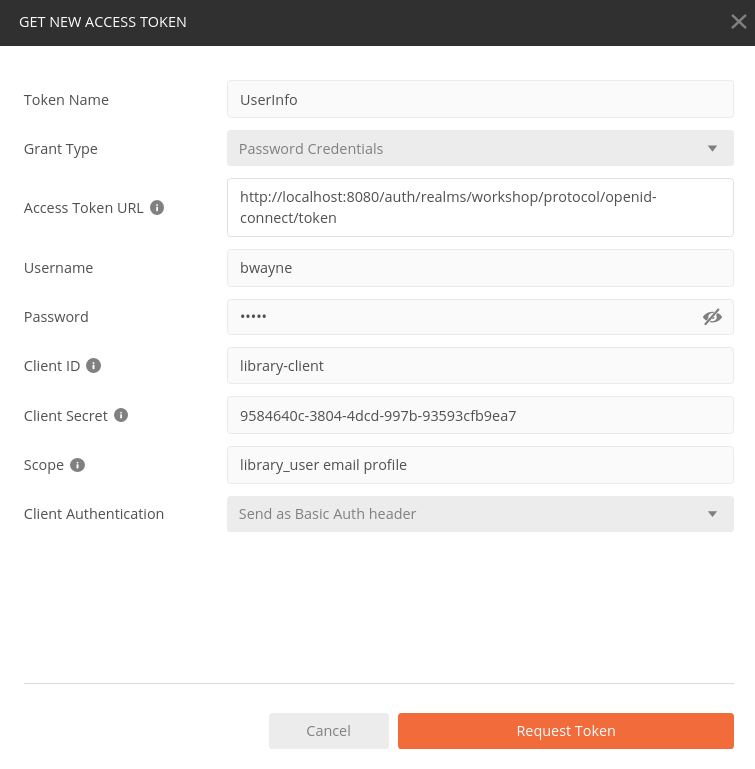
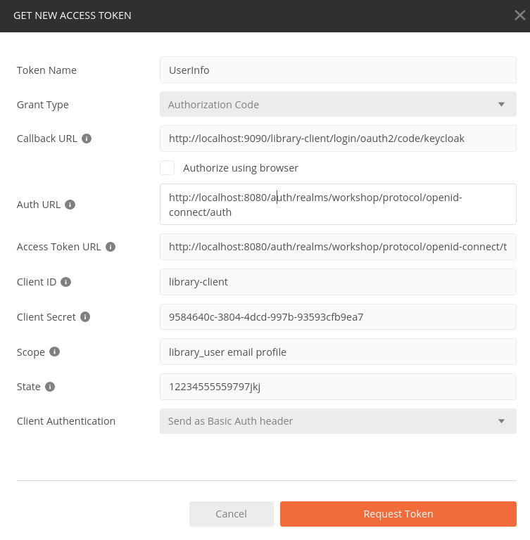

# Intro-Lab: OAuth 2.0 Authorization Grant Flows

This is the getting started lab for testing the simple OAuth 2.0 grants of [OAuth 2.0 Authorization](https://www.rfc-editor.org/rfc/rfc6749.html):

* Client Credentials
* Resource Owner Password

As part of this we can also achieve the following targets:

1. Make sure Keycloak is installed and working as expected
2. Get to know the tools to execute Http requests
  * Curl
  * Httpie
  * Postman  

## Run Keycloak

Make sure you have set up Keycloak as described in the [Setup](../../setup) section.
Then dependent on which approach you are using start Keycloak locally or via docker image.

## Client Credentials Grant

The first grant type we will evaluate here is the [OAuth 2.0 Client Credentials Grant](https://www.rfc-editor.org/rfc/rfc6749.html#section-4.4).



The required parameters for the client credentials grant are shown here:

| Parameter     | Value                                                                     | 
| --------------| ------------------------------------------------------------------------- | 
| token url     | http://localhost:8080/auth/realms/workshop/protocol/openid-connect/token  | 
| grant_type    | client_credentials                                                        | 
| client_id     | library-client                                                            | 
| client_secret | 9584640c-3804-4dcd-997b-93593cfb9ea7                                      | 
| scope         | library_user email profile                                                |

### Curl

To retrieve an access token using _curl_ use the following command in a terminal:

```curl
curl -X POST -H "Content-Type: application/x-www-form-urlencoded" -d "grant_type=client_credentials&client_id=library-client&client_secret=9584640c-3804-4dcd-997b-93593cfb9ea7" http://localhost:8080/auth/realms/workshop/protocol/openid-connect/token
```

This should return a response similar to this one:

```json
{
  "access_token":"eyJhbGciOiJSUzI1NiIsI...",
  "expires_in":300,
  "refresh_expires_in":1800,
  "refresh_token":"eyJhbGciOiJIUzI1N...",
  "token_type":"bearer",
  "not-before-policy":1571836504,
  "session_state":"48027c65-a98d-430b-b92e-6a84b183f66d",
  "scope":"library_user email profile"
}
```

### Httpie

To retrieve an access token using _httpie_ use the following command in a terminal:

```httpie
http --form POST localhost:8080/auth/realms/workshop/protocol/openid-connect/token grant_type='client_credentials' client_id='library-client' client_secret='9584640c-3804-4dcd-997b-93593cfb9ea7'
```

This should return a response similar to the one for curl.

### Postman

To get an access token via the client credentials grant using postman just create a new request (the request url is not important).
Then switch to the _Authorization_ tab and select _OAuth 2.0_ in the _Type_ drop down box.



Now click on the button _Get New Access Token_, this will open the following dialog.



Here, select _Client Credentials_ in the _Grant Type_ drop down box, then fill in the details of the Postman view shown 
using the required data above and click _Request Token_.

Then you should see the response in Postman:



## RO Password Credentials Grant

The next grant type we will evaluate here is the [OAuth 2.0 Resource Owner Password Credentials Grant](https://www.rfc-editor.org/rfc/rfc6749.html#section-4.3).



The required parameters for the RO password credentials grant are shown here:

| Parameter     | Value                                                                     | 
| --------------| ------------------------------------------------------------------------- | 
| token url     | http://localhost:8080/auth/realms/workshop/protocol/openid-connect/token  | 
| grant_type    | password                                                                  | 
| client_id     | library-client                                                            | 
| client_secret | 9584640c-3804-4dcd-997b-93593cfb9ea7                                      | 
| scope         | library_user email profile                                                |
| username      | bwayne                                                                    | 
| password      | wayne                                                                     | 

### Curl

To retrieve an access token using curl use the following command in a terminal:

```curl
curl -X POST -H "Content-Type: application/x-www-form-urlencoded" -d "grant_type=password&username=bwayne&password=wayne&client_id=library-client&client_secret=9584640c-3804-4dcd-997b-93593cfb9ea7" http://localhost:8080/auth/realms/workshop/protocol/openid-connect/token
```

This should return a response similar to this one:

```json
{
  "access_token":"eyJhbGciOiJSUzI1NiIsI...",
  "expires_in":300,
  "refresh_expires_in":1800,
  "refresh_token":"eyJhbGciOiJIUzI1N...",
  "token_type":"bearer",
  "not-before-policy":1571836504,
  "session_state":"48027c65-a98d-430b-b92e-6a84b183f66d",
  "scope":"library_user email profile"
}
```

### Httpie

To retrieve an access token using _httpie_ use the following command in a terminal:

```httpie
http --form POST localhost:8080/auth/realms/workshop/protocol/openid-connect/token grant_type='password' username='bwayne' password='wayne' client_id='library-client' client_secret='9584640c-3804-4dcd-997b-93593cfb9ea7'
```

This should return a response similar to the one for curl.

### Postman

To get an access token via the client credentials grant using postman just create a new request (the request url is not important).
Then switch to the _Authorization_ tab and select _OAuth 2.0_ in the _Type_ drop down box.


Now click on the button _Get New Access Token_, this will open the following dialog.



Here, select _Password Credentials_ in the _Grant Type_ drop down box, then fill in the details of the Postman view shown 
using the required data above and click _Request Token_.

Then you should see the response in Postman:


## Advanced: Authorization Code Grant

The [authorization code grant](https://www.rfc-editor.org/rfc/rfc6749.html#section-4.1) is the flow mostly used in today's applications adopting OAuth 2.0.
 
1. The flow starts with the authorization request, this redirects to the authorization server.
   Here the user logs in using his credentials and approves a consent page
2. After successfully logging in a 302 HTTP redirect request with the authorization code is being sent through to the browser which redirects
   to the callback entry point provided by the client application 
3. Now the client application sends a token request to the authorization server to exchange
   the authorization code into an access token
   
This grant cannot be performed completely in _curl_ or _httpie_ because of the interactive process of this grant flow requiring
the user to manually log in using a web form.

So, for this grant flow you have two possibilities:
1. Use Postman (Postman is able to completely manage this grant)
2. Use the web browser and then _curl_ or _httpie_: 
  * First create the authorization request and paste it as url to the web browser
  * Grab the authorization code from the redirect request url from the web browser
  * Then create the token request using _curl_ or _httpie_  
 
### Postman

To get an access token via the authorization code grant using postman just create a new request (the request url is not important).
Then switch to the _Authorization_ tab and select _OAuth 2.0_ in the _Type_ drop down box.


Now click on the button _Get New Access Token_, this will open the following dialog.



Here, select _Authorization Code_ in the _Grant Type_ drop down box, then fill in the details of the Postman view shown 
using the required data above and click _Request Token_. You may also switch on _Authorize using browser_ check box, then
Postman uses your web browser for the redirects instead of its own window.

Then you should see the response in Postman:

 
 

### Curl

To achieve the same using _curl_ first copy this request into the page url of your web browser:

```uri
http://localhost:8080/auth/realms/workshop/protocol/openid-connect/auth?response_type=code&client_id=demo-client&redirect_uri=http://localhost:9095/client/callback
``` 

Now log in using _bwayne_/_wayne_ then you should get an error message in the browser (because the callback address of the redirect is not found).
The important part can be seen in the url of the web browser:

```uri
http://localhost:9095/client/callback?session_state=8d475e5d-d096-42f9-9f0b-8ae9de7406e0&code=b646d53e-8f12-42ee-bff4-e8db1fb5874f.8d475e5d-d096-42f9-9f0b-8ae9de7406e0.58f0efec-2e91-4c63-823f-85280996f8a5
``` 

Just copy the _code_ parameter:

`code=b646d53e-8f12-42ee-bff4-e8db1fb5874f.8d475e5d-d096-42f9-9f0b-8ae9de7406e0.58f0efec-2e91-4c63-823f-85280996f8a5`

and use this in the _curl_ request to get an access token:

```curl
curl -X POST -H "Content-Type: application/x-www-form-urlencoded" -d "grant_type=authorization_code&code=[fill with your code]&redirect_uri=http://localhost:9095/client/callback&client_id=demo-client&client_secret=b3ec9d3f-d1ee-4a18-b4ba-05d832c15293" http://localhost:8080/auth/realms/workshop/protocol/openid-connect/token
```

As response, you should get an access token.

According to the [OAuth2 specification](https://tools.ietf.org/html/rfc6749#section-4.1.2):

<blockquote cite="https://tools.ietf.org/html/rfc6749#section-4.1.2">
The authorization code MUST expire shortly after it is issued to mitigate the risk of leaks.  
A maximum authorization code lifetime of 10 minutes is RECOMMENDED. 
The client MUST NOT use the authorization code more than once. 
</blockquote>

Keycloak uses a really short authorization code lifetime of 2 minutes by default.
So you only have 2 minutes to grab the authorization code from the web browser and copy it to the _curl_ request!

In the next labs we won't have to create all the requests on our own, instead we will let Spring Security do the work for us.      


