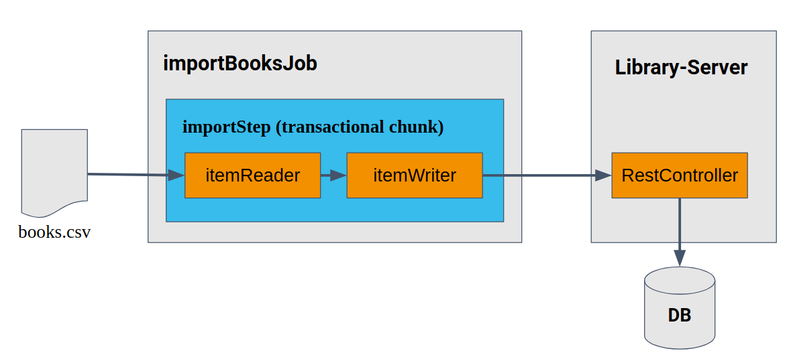

# Lab 3: Creating an OAuth 2.0/OIDC compliant Client (Client Credentials Flow)

In this third lab we want to build again an OAuth2/OIDC client for the resource server 
we have built in [lab 1](../lab1).

In contrast to [Lab 2](../lab2) this time the client will be using
the [OAuth2 client credentials grant flow](https://tools.ietf.org/html/rfc6749#section-4.4).


See [Spring Security 5 OAuth 2.0 Client reference doc](https://docs.spring.io/spring-security/site/docs/current/reference/htmlsingle/#webclient) 
for all details on how to build and configure a OAuth 2.0 client. 

## Lab Contents

* [Learning Targets](#learning-targets)
  * [Batch Client Application](#the-batch-client-application)
* [Folder Contents](#folder-contents)
* [Hands-On: Implement the OAuth 2.0/OIDC batch client](#start-the-lab)
    * [Explore the initial client application](#explore-the-initial-application)
    * [Step 1: Configure as OAuth2/OIDC client w/ client credentials](#step-1-configure-as-oauth-2oidc-client-with-client-credentials)
    * [Step 2: Configure web client to send bearer access token](#step-2-configure-web-client-to-send-bearer-access-token)
    * [Step 3: Run and debug the web client authorities](#step-3-rundebug-the-oauth2-batch-job-client-application)

## Learning Targets

In this third workshop lab you will be provided a complete spring batch client application that works
together with the [resource server of Lab 1](../lab1/library-server-complete/README.md). 

In contrast to [Lab 2](../lab2/README.md) this time we will see how to build a client without a web environment 
by using the [OAuth2 client credentials grant flow](https://tools.ietf.org/html/rfc6749#section-4.4).

According to the specification this grant flow is described as follows:
<blockquote cite="https://tools.ietf.org/html/rfc6749#section-4.4">The client can request an access token using only its client credentials 
(or other supported means of authentication) when the client is requesting access to the protected resources 
under its control</blockquote>

__Important Note: The client credentials grant type MUST only be used by confidential clients.__

After you have completed this lab you will have learned:

* that you can also use OAuth2 and OpenID Connect in a non-web environment using the client credentials flow
* how to configure the reactive web client for the client credentials flow
* implementing batch jobs using the spring batch framework

### The Batch Client Application

The client of this lab is just able to fulfill the following uses case:

* Batch import of books into the library using a CSV file

Batch jobs can be implemented by using the [Spring Batch Project](https://spring.io/projects/spring-batch).
We cannot dive into the world of batch jobs as part of this workshop. If you want to know more on how
you implement batch jobs then you may have a look into the intro section of the 
corresponding [Spring Batch Reference Documentation](https://docs.spring.io/spring-batch/4.2.x/reference/html/spring-batch-intro.html#spring-batch-intro).

Here is how the batch job for this lab looks like:



## Folder Contents

In the folder for lab 3 you find 2 applications:

* __library-client-credentials-initial__: This is the client application we will use as starting point for this lab
* __library-client-credentials-complete__: This client application is the completed OAuth 2.0/OIDC client for this lab 

## Start the Lab

Now, let's start with Lab 3. Here we will implement the required additions to get an 
OAuth2/OIDC compliant batch job client that calls the resource server we have implemented in [lab 1](../lab1).
This time we will use the client credentials flow.

We will use [Keycloak](https://keycloak.org) as identity provider.  
Please again make sure you have set up keycloak as described in [Setup Keycloak](../setup).

### Explore the initial application

First start the resource server application of Lab 1. If you could not complete the previous Lab yourself
then use and start the completed reference application 
in project [lab1/library-server-complete](../lab1/library-server-complete)

Then navigate your Java IDE to the __lab3/library-client-credentials-initial__ project and at first explore this project a bit.  
Then start the application by running the class _com.example.library.client.Lab3LibraryClientCredentialsInitialApplication_.

You will notice that the batch job does complete with a failure status.
This is because the batch job is not authenticated to import books into the library.
You can see the corresponding error message  
 `checkpoint ⇢ 401 from POST http://localhost:9091/library-server/books [DefaultWebClient]`  
 in the console log. 

Now stop the client application again. You can leave the resource server running as we will need this after we have 
finished this client.

<hr>

### Step 1: Configure as OAuth 2/OIDC client with client credentials
  
__Make sure keycloak has been started as described in the [setup section](../setup).__

To get rid of the authentication error we will now configure the OAuth2 client credentials flow for our 
batch job application. A batch job is a typical machine-to-machine use case for this type of OAuth2 flow. 

This time we use the java based client registration for configuring OAuth2/OIDC. 
  
For OAuth2 clients using client credentials as flow you have to specify the client registration (with client id, client secret, 
authorization grant type). A redirect uri is not required this time as now redirect will happen for this kind of flow.

To perform this step, open the file _WebClientConfiguration.java_ and add the following bean containing the OAuth2/OIDC
client registration for the client credentials flow.
 
```java
...
import org.springframework.context.annotation.Bean;
import org.springframework.context.annotation.Configuration;
import org.springframework.context.annotation.Profile;
import org.springframework.security.oauth2.client.AuthorizedClientServiceReactiveOAuth2AuthorizedClientManager;
import org.springframework.security.oauth2.client.InMemoryReactiveOAuth2AuthorizedClientService;
import org.springframework.security.oauth2.client.ReactiveOAuth2AuthorizedClientService;
import org.springframework.security.oauth2.client.registration.ClientRegistration;
import org.springframework.security.oauth2.client.registration.ClientRegistrations;
import org.springframework.security.oauth2.client.registration.InMemoryReactiveClientRegistrationRepository;
import org.springframework.security.oauth2.client.registration.ReactiveClientRegistrationRepository;
import org.springframework.security.oauth2.client.web.reactive.function.client.ServerOAuth2AuthorizedClientExchangeFilterFunction;
import org.springframework.security.oauth2.core.AuthorizationGrantType;
import org.springframework.web.reactive.function.client.WebClient;
...

  @Bean
  ReactiveClientRegistrationRepository clientRegistrations() {
    ClientRegistration clientRegistration = ClientRegistrations
            .fromOidcIssuerLocation("http://localhost:8080/auth/realms/workshop")
            .registrationId("library_client")
            .clientId("library-client")
            .clientSecret("9584640c-3804-4dcd-997b-93593cfb9ea7")
            .authorizationGrantType(AuthorizationGrantType.CLIENT_CREDENTIALS)
            .build();
    return new InMemoryReactiveClientRegistrationRepository(clientRegistration);
  }

  @Bean
  ReactiveOAuth2AuthorizedClientService authorizedClientService() {
    return new InMemoryReactiveOAuth2AuthorizedClientService(clientRegistrations());
  }
```

This adds registration for pre-defined _library_client_, the important part is the different 
authorization grant type _AuthorizationGrantType.CLIENT_CREDENTIALS_.

<hr>

### Step 2: Configure web client to send bearer access token

The batch job uses the new reactive _WebClient_ to call the corresponding server endpoint for creating books.
Now the existing web client configuration in _WebClientConfiguration.java_ needs to be extended to use this new
registered OAuth2 client to automatically fetch and use an OAuth2/OIDC access token.

To achieve this change the existing WebClient configuration in _WebClientConfiguration.java_ as follows:

```java
...
import org.springframework.context.annotation.Bean;
import org.springframework.context.annotation.Configuration;
import org.springframework.context.annotation.Profile;
import org.springframework.security.oauth2.client.AuthorizedClientServiceReactiveOAuth2AuthorizedClientManager;
import org.springframework.security.oauth2.client.InMemoryReactiveOAuth2AuthorizedClientService;
import org.springframework.security.oauth2.client.ReactiveOAuth2AuthorizedClientService;
import org.springframework.security.oauth2.client.registration.ClientRegistration;
import org.springframework.security.oauth2.client.registration.ClientRegistrations;
import org.springframework.security.oauth2.client.registration.InMemoryReactiveClientRegistrationRepository;
import org.springframework.security.oauth2.client.registration.ReactiveClientRegistrationRepository;
import org.springframework.security.oauth2.client.web.reactive.function.client.ServerOAuth2AuthorizedClientExchangeFilterFunction;
import org.springframework.security.oauth2.core.AuthorizationGrantType;
import org.springframework.web.reactive.function.client.WebClient;
...

  @Bean
  WebClient webClient(ReactiveClientRegistrationRepository clientRegistrations, ReactiveOAuth2AuthorizedClientService authorizedClientService) {
    ServerOAuth2AuthorizedClientExchangeFilterFunction oauth =
            new ServerOAuth2AuthorizedClientExchangeFilterFunction(
                    new AuthorizedClientServiceReactiveOAuth2AuthorizedClientManager(clientRegistrations, authorizedClientService));
    oauth.setDefaultClientRegistrationId("library_client");
    return WebClient.builder()
            .filter(oauth)
            .build();
  }
...
```

<hr>

### Step 3: Run/debug the OAuth2 batch job client application
  
Now re-start the library client and have a look into the console log.
This time the batch job should have been completed successfully.

If you want to check that the new books really have been imported just use the 
web client of [Lab 2](../lab2). After you log in you should see lots of more books than before.
Alternatively you could also just use _Postman_, _Curl_ or _Httpie_. 
 
<hr>

That's a wrap for this third Lab.

Let's continue with [Lab 4](../lab4) to see how you can test your resource server from [Lab 1](../lab1) with unit and integration tests.

